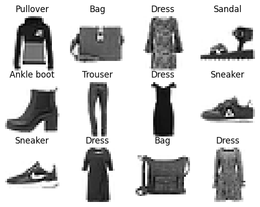
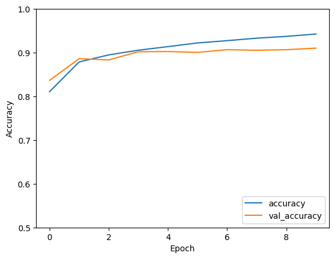
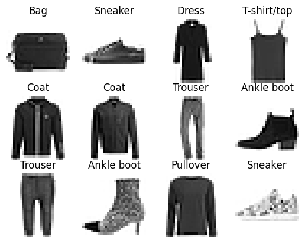

# TP CNN - Rapport

Auteurs: Ludovico Grabau & Damian Boquete Costa

<br>

- [TP CNN - Rapport](#tp-cnn---rapport)
  - [Introduction](#introduction)
    - [1. Qu'est ce qu'un réseau de neuronnes convolutifs (CNN) ?](#1-quest-ce-quun-réseau-de-neuronnes-convolutifs-cnn-)
    - [2. Quels sont les composants d'un CNN ?](#2-quels-sont-les-composants-dun-cnn-)
    - [3. Concept de transfer learning](#3-concept-de-transfer-learning)
    - [4. Concept de fine tuning](#4-concept-de-fine-tuning)
  - [Modèles pré-entrainés](#modèles-pré-entrainés)
    - [VGG16](#vgg16)
      - [Prédiction 1](#prédiction-1)
      - [Prédiction 2](#prédiction-2)
      - [Prédiction 3](#prédiction-3)
      - [Prédiction 4](#prédiction-4)
      - [Prédiction 5](#prédiction-5)
    - [Xception](#xception)
      - [Prédiction 1](#prédiction-1-1)
      - [Prédiction 2](#prédiction-2-1)
      - [Prédiction 3](#prédiction-3-1)
      - [Prédiction 4](#prédiction-4-1)
      - [Prédiction 5](#prédiction-5-1)
    - [MobileNet](#mobilenet)
      - [Prédiction 1](#prédiction-1-2)
      - [Prédiction 2](#prédiction-2-2)
      - [Prédiction 3](#prédiction-3-2)
      - [Prédiction 4](#prédiction-4-2)
      - [Prédiction 5](#prédiction-5-2)
  - [Modèle customisé](#modèle-customisé)
    - [Présention du dataset](#présention-du-dataset)
    - [Création du modèle](#création-du-modèle)
    - [Entrainement du modèle](#entrainement-du-modèle)
    - [Prédiction](#prédiction)
      - [Courbe de précision](#courbe-de-précision)
      - [Prédiction des données du dataset](#prédiction-des-données-du-dataset)
  - [Ressources](#ressources)

<div style="page-break-after: always;"></div>

## Introduction

### 1. Qu'est ce qu'un réseau de neuronnes convolutifs (CNN) ?

C'est un réseau de neurones de type "feed-forward" dont l'inspiration de sa structure est tirée du cortex visuel des animaux.
Il est composé de deux parties, une partie convolutionnelle et une partie classique.
La partie convolutive fonctionne suivant un principe de "extracteur de features", il va alors effectuer du "template matching" sur l'image d'entrée, en lui appliquant des opérations de filtrage convolutif, dans le but de retourner ce qu'on appelle des "feature maps" qui seront également normalisées et redimmensionnées.
Toutes ces étapes permettent donc de ressortir des informations pertinentes de l'image d'entrée, qui seront ensuite traitées par la partie classique du réseau de neurones. Cette partie classique est composée de couches de neurones, qui vont permettre de classifier l'image de sortie avec sa classe correspondante, selon une probabilité de 0 à 1.

### 2. Quels sont les composants d'un CNN ?

Un CNN est composé de plusieurs composants, que l'on appelle également couches (layers), qui sont les suivants:
- Convolution: permet de faire des opérations de filtrage convolutif (à l'aide de noyaux) sur l'image d'entrée, pour en extraire des informations pertinentes (features)
- Pooling: permet de réduire la taille de l'image et de conserver les informations importantes, pour éviter le sur-apprentissage et consolider les features extraites
- Correction ReLU (Rectified Linear Unit): permet de remplacer les valeurs négatives avec des zéros pour la couche précédente (fonction d'activation)
- Dense: permet de récuperer les informations de la couche précédente et de les traiter avec une combinaison linaire, puis une fonction d'activation, pour produire en sortie un vecteur de probabilités entre 0 et 1 (c'est la couche classique du réseau de neurones)

<div style="page-break-after: always;"></div>

### 3. Concept de transfer learning

De façon générale, le "transfer learning", ou apprentissage par transfert, est un concept qui permet de réutiliser un modèle pré-entrainé pour un problème donné, afin de l'adapter à un nouveau problème. Ceci permet de gagner du temps et de l'argent, car on n'a pas besoin de réentrainer le modèle de zéro, mais seulement de le fine-tuner, en d'autre mots de l'adapter à notre nouveau problème. Selon sa définition sur le site "datascientist.com",

    Le Transfer Learning, ou apprentissage par transfert en français, désigne l’ensemble des méthodes qui permettent de transférer les connaissances acquises à partir de la résolution de problèmes donnés pour traiter un autre problème.

Le transfer learning est apparu suite à l'essor du Deep Learning, et est devenu une technique très utilisée dans le domaine de l'intelligence artificielle.

Cette technologie est principalement utilisée pour les problèmes de classification d'images, car les modèles pré-entrainés sont souvent des CNN, et les images sont souvent utilisées comme entrées. Il existe plusieurs modèles pré-entrainés, dont les plus connus sont VGG16, VGG19, ResNet50, InceptionV3, Xception, etc. Ces modèles sont entrainés sur des bases de données comme ImageNet, qui contient plus de 14 millions d'images, et qui sont classées en 1000 catégories.

Ces modèles sont donc très performants, et peuvent être utilisés pour des problèmes de classification d'images, comme la reconnaissance d'objets, la détection de visages, etc. Il existe également des modèles pré-entrainés pour d'autres types de problèmes, comme la classification de sons, de textes, etc.

### 4. Concept de fine tuning

Le fine tuning, est une technique qui permet de réentrainer un modèle pré-entrainé, afin de l'adapter à un nouveau problème. Cette technique est utilisée dans le cadre du transfer learning, et permet de réentrainer le modèle sur un nouveau jeu de données, en gardant les poids du modèle pré-entrainé, et en les ajustant à notre nouveau problème. 

Il ne cherche pas spécialement à faire du sur-apprentissage, mais plutôt à améliorer la performance du modèle avec de nouvelles données plus ciblées. D'où le terme "fine tuning", qui signifie "ajustement fin", donc l'idée de peaufiner davantage quelque chose d'existant. Il y a deux cas où le fine tuning est bénéfique, le premier est quand on souhaite accélérer l'entrainement du modèle, et le second est quand on souhaite améliorer la performance du modèle pour une taille de donnée spécifique.

<div style="page-break-after: always;"></div>

## Modèles pré-entrainés

Le but est de "transfer learn" et "fine tune" plusieurs modèles pré-entrainés (VGG16, Xception et MobileNet) avec un dataset constitué de :

- Chats
- Vaches
- Crabes
- Avocats

Toutes les images utilisées sont préformatées sur un format de 150x150x3.

### VGG16

Resultats lors de l'entrainement (Transfer learning @ epochs = 1)

```
10/10 [==============================] - 12s 1s/step - loss: 4.2517 - accuracy: 0.7695
4/4   [==============================] - 4s 801ms/step - loss: 0.8862 - accuracy: 0.9314

vgg16 transfer learned:
        Loss: 0.8861851692199707 
        Accuracy: 0.9313725233078003
```

Resultats lors de l'entrainement (Fine tuning @ epochs = 1 & LR = 1e-5)

```
10/10 [==============================] - 50s 5s/step - loss: 0.2640 - accuracy: 0.9481
4/4   [==============================] - 4s 904ms/step - loss: 0.0986 - accuracy: 0.9804

vgg16 fine tuned:
        Loss: 0.09856945276260376 
        Accuracy: 0.9803921580314636
```

<div style="page-break-after: always;"></div>

#### Prédiction 1


```
Results provided by selected model:
        #1 avocado @ 100.00%
        #2 cat @ 0.00%
        #3 cow @ 0.00%
        #4 crab @ 0.00%
```

#### Prédiction 2


```
Results provided by selected model:
        #1 avocado @ 0.00%
        #2 cat @ 0.86%
        #3 cow @ 99.14%
        #4 crab @ 0.00%
```

#### Prédiction 3


```
Results provided by selected model:
        #1 avocado @ 0.00%
        #2 cat @ 98.96%
        #3 cow @ 1.04%
        #4 crab @ 0.00%
```

#### Prédiction 4


```
Results provided by selected model:
        #1 avocado @ 0.00%
        #2 cat @ 0.00%
        #3 cow @ 100.00%
        #4 crab @ 0.00%
```

#### Prédiction 5


```
Results provided by selected model:
        #1 avocado @ 0.00%
        #2 cat @ 0.00%
        #3 cow @ 0.00%
        #4 crab @ 100.00%
```

<div style="page-break-after: always;"></div>

### Xception

Resultats lors de l'entrainement (Transfer learning @ epochs = 5)

```
Epoch 1/5
10/10 [==============================] - 7s 476ms/step - loss: 38.3898 - accuracy: 0.3896
Epoch 2/5
10/10 [==============================] - 5s 463ms/step - loss: 12.2358 - accuracy: 0.5649
Epoch 3/5
10/10 [==============================] - 5s 464ms/step - loss: 5.1830 - accuracy: 0.5227
Epoch 4/5
10/10 [==============================] - 5s 459ms/step - loss: 3.0847 - accuracy: 0.6104
Epoch 5/5
10/10 [==============================] - 5s 460ms/step - loss: 1.6424 - accuracy: 0.7045
4/4   [==============================] - 2s 351ms/step - loss: 3.2809 - accuracy: 0.4902

xception transfer learned:
        Loss: 3.280911922454834 
        Accuracy: 0.4901960790157318
```

Resultats lors de l'entrainement (Fine tuning @ epochs = 3 & LR = 1e-5)

```
Epoch 1/3
10/10 [==============================] - 36s 3s/step - loss: 1.3111 - accuracy: 0.3896
Epoch 2/3
10/10 [==============================] - 27s 3s/step - loss: 1.1913 - accuracy: 0.5779
Epoch 3/3
10/10 [==============================] - 27s 3s/step - loss: 1.0818 - accuracy: 0.6786
4/4 [==============================] - 2s 342ms/step - loss: 1.0505 - accuracy: 0.6078
xception fine tuned:
        Loss: 1.0504629611968994 
        Accuracy: 0.6078431606292725
```

<div style="page-break-after: always;"></div>

#### Prédiction 1


```
Results provided by selected model:
        #1 avocado @ 24.11%
        #2 cat @ 25.04%
        #3 cow @ 34.28%
        #4 crab @ 16.57%
```
#### Prédiction 2


```
Results provided by selected model:
        #1 avocado @ 58.49%
        #2 cat @ 15.99%
        #3 cow @ 14.27%
        #4 crab @ 11.24%
```

#### Prédiction 3


```
Results provided by selected model:
        #1 avocado @ 46.99%
        #2 cat @ 6.83%
        #3 cow @ 37.82%
        #4 crab @ 8.37%
```

#### Prédiction 4


```
Results provided by selected model:
        #1 avocado @ 57.15%
        #2 cat @ 4.02%
        #3 cow @ 30.40%
        #4 crab @ 8.42%
```

#### Prédiction 5


```
Results provided by selected model:
        #1 avocado @ 40.21%
        #2 cat @ 12.65%
        #3 cow @ 31.16%
        #4 crab @ 15.98%
```

<div style="page-break-after: always;"></div>

### MobileNet

Resultats lors de l'entrainement (Transfer learning @ epochs = 5)

```
Epoch 1/5
10/10 [==============================] - 3s 143ms/step - loss: 1.6251 - accuracy: 0.6039
Epoch 2/5
10/10 [==============================] - 2s 141ms/step - loss: 0.3966 - accuracy: 0.8604
Epoch 3/5
10/10 [==============================] - 2s 139ms/step - loss: 0.2654 - accuracy: 0.9156
Epoch 4/5
10/10 [==============================] - 2s 135ms/step - loss: 0.1424 - accuracy: 0.9578
Epoch 5/5
10/10 [==============================] - 2s 134ms/step - loss: 0.0847 - accuracy: 0.9805
4/4   [==============================] - 1s 110ms/step - loss: 0.4701 - accuracy: 0.8431

mobilenet transfer learned:
        Loss: 0.4701266586780548 
        Accuracy: 0.843137264251709
```

Resultats lors de l'entrainement (Fine tuning @ epochs = 4 & LR = 1e-5)

```
Epoch 1/4
10/10 [==============================] - 12s 680ms/step - loss: 1.0985 - accuracy: 0.7532
Epoch 2/4
10/10 [==============================] - 7s 673ms/step - loss: 0.7428 - accuracy: 0.7890
Epoch 3/4
10/10 [==============================] - 7s 686ms/step - loss: 0.4501 - accuracy: 0.8539
Epoch 4/4
10/10 [==============================] - 7s 669ms/step - loss: 0.3216 - accuracy: 0.8994
4/4   [==============================] - 1s 98ms/step - loss: 0.5583 - accuracy: 0.8039

mobilenet fine tuned:
        Loss: 0.5582880973815918 
        Accuracy: 0.8039215803146362
```

<div style="page-break-after: always;"></div>

#### Prédiction 1


```
Results provided by selected model:
        #1 avocado @ 4.53%
        #2 cat @ 93.93%
        #3 cow @ 1.29%
        #4 crab @ 0.25%
```

#### Prédiction 2


```
Results provided by selected model:
        #1 avocado @ 100.00%
        #2 cat @ 0.00%
        #3 cow @ 0.00%
        #4 crab @ 0.00%
```

#### Prédiction 3


```
Results provided by selected model:
        #1 avocado @ 35.55%
        #2 cat @ 0.00%
        #3 cow @ 0.34%
        #4 crab @ 64.12%
```

#### Prédiction 4


```
Results provided by selected model:
        #1 avocado @ 16.23%
        #2 cat @ 3.77%
        #3 cow @ 79.96%
        #4 crab @ 0.04%
```

#### Prédiction 5


```
Results provided by selected model:
        #1 avocado @ 97.48%
        #2 cat @ 0.00%
        #3 cow @ 0.00%
        #4 crab @ 2.52%
```

<div style="page-break-after: always;"></div>

## Modèle customisé

Le but est de créer notre propre modèle et de le tester sur le dataset de MNIST Fashion (habits).

### Présention du dataset

Voici un exemple de données du dataset MNIST Fashion. Nous avons là 12 images de taille 28x28 pixels. Chaque image est associée à une classe (0 à 9) qui représente le type d'habits représenté sur l'image. Les classes sont les suivantes: T-shirt/top, Trouser, Pullover, Dress, Coat, Sandal, Shirt, Sneaker, Bag et Ankle boot.

<p align="center">
    
</p>

<div style="page-break-after: always;"></div>

### Création du modèle

Juste en dessous, vous trouverez le modèle CNN que nous avons construit séquentiellement. Il est composé de 3 couches de convolution, 2 couches de pooling, 1 couche de flatten et 2 couches de type dense. Nous avons utilisé la fonction d'activation `relu` pour les couches de convolution et de type dense. Pour la couche de sortie, nous avons utilisé la fonction d'activation `softmax` car nous faisons face à un problème de classification multiclasse.

```
Model: "sequential"
_________________________________________________________________
 Layer (type)                Output Shape              Param #   
=================================================================
 conv2d (Conv2D)             (None, 26, 26, 32)        320       
                                                                 
 max_pooling2d (MaxPooling2D  (None, 13, 13, 32)       0         
 )                                                               
                                                                 
 conv2d_1 (Conv2D)           (None, 11, 11, 64)        18496     
                                                                 
 max_pooling2d_1 (MaxPooling  (None, 5, 5, 64)         0         
 2D)                                                             
                                                                 
 conv2d_2 (Conv2D)           (None, 3, 3, 64)          36928     
                                                                 
 flatten (Flatten)           (None, 576)               0         
                                                                 
 dense (Dense)               (None, 64)                36928     
                                                                 
 dense_1 (Dense)             (None, 10)                650       
                                                                 
=================================================================
Total params: 93,322
Trainable params: 93,322
Non-trainable params: 0
_________________________________________________________________
```

<div style="page-break-after: always;"></div>

### Entrainement du modèle

Nous avons ci-dessous les résultats de l'entrainement du modèle cnn customisé sur le dataset normalisé de MNIST Fashion. L'entrainement a été fait sur 10 epochs pour 6000 images de train et 1000 images de test à travers 10 catégories (classes/labels). Le modèle a une accuracy de 91.03% sur les données de test.

```
Epoch 1/10
1875/1875 [==============================] - 19s 10ms/step - loss: 0.5141 - accuracy: 0.8108 - val_loss: 0.4426 - val_accuracy: 0.8365
Epoch 2/10
1875/1875 [==============================] - 24s 13ms/step - loss: 0.3313 - accuracy: 0.8788 - val_loss: 0.3165 - val_accuracy: 0.8862
Epoch 3/10
1875/1875 [==============================] - 25s 13ms/step - loss: 0.2861 - accuracy: 0.8949 - val_loss: 0.3170 - val_accuracy: 0.8834
Epoch 4/10
1875/1875 [==============================] - 20s 11ms/step - loss: 0.2532 - accuracy: 0.9056 - val_loss: 0.2749 - val_accuracy: 0.9021
Epoch 5/10
1875/1875 [==============================] - 20s 11ms/step - loss: 0.2301 - accuracy: 0.9138 - val_loss: 0.2691 - val_accuracy: 0.9026
Epoch 6/10
1875/1875 [==============================] - 22s 12ms/step - loss: 0.2093 - accuracy: 0.9223 - val_loss: 0.2835 - val_accuracy: 0.9006
Epoch 7/10
1875/1875 [==============================] - 23s 12ms/step - loss: 0.1946 - accuracy: 0.9274 - val_loss: 0.2712 - val_accuracy: 0.9068
Epoch 8/10
1875/1875 [==============================] - 19s 10ms/step - loss: 0.1788 - accuracy: 0.9331 - val_loss: 0.2709 - val_accuracy: 0.9055
Epoch 9/10
1875/1875 [==============================] - 24s 13ms/step - loss: 0.1670 - accuracy: 0.9372 - val_loss: 0.2808 - val_accuracy: 0.9068
Epoch 10/10
1875/1875 [==============================] - 23s 12ms/step - loss: 0.1530 - accuracy: 0.9427 - val_loss: 0.2674 - val_accuracy: 0.9103
313/313 - 1s - loss: 0.2674 - accuracy: 0.9103 - 650ms/epoch - 2ms/step
```

<div style="page-break-after: always;"></div>

### Prédiction

#### Courbe de précision

L'image ci-dessous montre la courbe de précision du modèle comparé à la précision du dataset de test. On peut voir que le modèle a une précision de 91% sur le dataset de test et une précision de 94% sur le dataset d'entrainement. On peut donc également dire que le modèle a bien appris des données d'entrainement et qu'il est capable d'opérer correctement sur les données de test.

<p align="center">
    
</p>

La légende "accuracy" représente la précision du modèle sur le dataset d'entrainement et la légende "val_accuracy" représente la précision du modèle sur le dataset de test.

Voici les résultats de la précision et des pertes du modèle sur le dataset de test.

```
Test accuracy: 0.9103000164031982
Test loss: 0.2673785984516144
```

<div style="page-break-after: always;"></div>

#### Prédiction des données du dataset

Voici une image des prédictions du modèle sur 12 images aléatoires du dataset.

<p align="center">
    
</p>

Plus bas on peut voir que le modèle a bien traité les images du dataset avec une précision de 91% et le nom de l'habits prédit affiché sous la barre de chargement de la prédiction.

<div style="page-break-after: always;"></div>

```
1/1 [==============================] - 0s 64ms/step
Results provided by custom model: #1 Bag @ 100.00%
1/1 [==============================] - 0s 11ms/step
Results provided by custom model: #1 Sneaker @ 100.00%
1/1 [==============================] - 0s 11ms/step
Results provided by custom model: #1 Pullover @ 0.12%
                                  #2 Dress @ 53.78%
                                  #3 Coat @ 45.73%
                                  #4 Shirt @ 0.36%
1/1 [==============================] - 0s 11ms/step
Results provided by custom model: #1 T-shirt/top @ 74.91%
                                  #2 Trouser @ 0.04%
                                  #3 Pullover @ 2.32%
                                  #4 Dress @ 0.11%
                                  #5 Shirt @ 22.52%
                                  #6 Bag @ 0.10%
1/1 [==============================] - 0s 11ms/step
Results provided by custom model: #1 Coat @ 98.54%
                                  #2 Shirt @ 1.45%
1/1 [==============================] - 0s 11ms/step
Results provided by custom model: #1 Pullover @ 4.40%
                                  #2 Coat @ 90.77%
                                  #3 Shirt @ 4.83%
1/1 [==============================] - 0s 11ms/step
Results provided by custom model: #1 Trouser @ 100.00%
1/1 [==============================] - 0s 11ms/step
Results provided by custom model: #1 Ankle boot @ 100.00%
1/1 [==============================] - 0s 11ms/step
Results provided by custom model: #1 Trouser @ 100.00%
1/1 [==============================] - 0s 11ms/step
Results provided by custom model: #1 Sneaker @ 0.03%
                                  #2 Ankle boot @ 99.97%
1/1 [==============================] - 0s 11ms/step
Results provided by custom model: #1 T-shirt/top @ 0.03%
                                  #2 Pullover @ 99.25%
                                  #3 Coat @ 0.03%
                                  #4 Shirt @ 0.70%
1/1 [==============================] - 0s 11ms/step
Results provided by custom model: #1 Sandal @ 0.33%
                                  #2 Sneaker @ 99.67%
```

<div style="page-break-after: always;"></div>

## Ressources

- <https://medium.com/analytics-vidhya/complete-guide-to-cnn-for-mnist-digits-classification-with-tensorflow-2-x-a29680ced311>
- <https://www.tensorflow.org/datasets/catalog/overview#all_datasets>
- <https://www.tensorflow.org/tutorials/images/transfer_learnings>
- <https://www.tensorflow.org/tutorials/images/cnn>
- <https://en.wikipedia.org/wiki/LeNet>
- <https://www.kaggle.com/code/arbazkhan971/image-classification-using-cnn-94-accuracy>
- <https://kaggle.com/gabrielamesa/animalsgabriela>
- <https://www.analyticsvidhya.com/blog/2020/02/learn-image-classification-cnn-convolutional-neural-networks-3-datasets/>
- <https://towardsdatascience.com/using-convolutional-neural-network-for-image-classification-5997bfd0ede4>
- <https://fr.wikipedia.org/wiki/R%C3%A9seau_neuronal_convolutif>
- <https://datascientest.com/convolutional-neural-network>
- <https://smltar.com/dlcnn.html>
- <https://openclassrooms.com/fr/courses/4470531-classez-et-segmentez-des-donnees-visuelles/5083336-decouvrez-les-differentes-couches-dun-cnn>
- <https://openclassrooms.com/fr/courses/4470531-classez-et-segmentez-des-donnees-visuelles/5082166-quest-ce-quun-reseau-de-neurones-convolutif-ou-cnn>
- <https://www.v7labs.com/blog/transfer-learning-guide>
- <https://fr.wikipedia.org/wiki/Apprentissage_par_transfert>
- <https://machinelearningmastery.com/transfer-learning-for-deep-learning/>
- <https://datascientest.com/transfer-learning>
- <https://stats.stackexchange.com/questions/331369/what-is-meant-by-fine-tuning-of-neural-network>
- <https://pynative.com/python-random-randrange/>
- <https://machinelearningmastery.com/how-to-develop-a-convolutional-neural-network-from-scratch-for-mnist-handwritten-digit-classification/>
- <http://www.eamonfleming.com/projects/fashion-mnist.html>